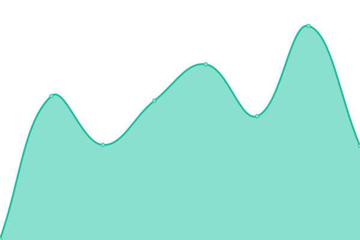

# [📈 Live Status](https://demo.upptime.js.org): <!--live status--> **🟩 All systems operational**

This repository contains the open-source uptime monitor and status page for [immodded](https://darksied.pages.dev/), powered by [Upptime](https://github.com/upptime/upptime).

With [Upptime](https://upptime.js.org), you can get your own unlimited and free uptime monitor and status page, powered entirely by a GitHub repository. We use [Issues](https://github.com/immodded/up_time/issues) as incident reports, [Actions](https://github.com/immodded/up_time/actions) as uptime monitors, and [Pages](https://demo.upptime.js.org) for the status page.

<!--start: status pages-->
<!-- This summary is generated by Upptime (https://github.com/upptime/upptime) -->
<!-- Do not edit this manually, your changes will be overwritten -->
<!-- prettier-ignore -->
| URL | Status | History | Response Time | Uptime |
| --- | ------ | ------- | ------------- | ------ |
|  [hanime](https://hanime.onrender.com) | 🟩 Up | [hanime.yml](https://github.com/immodded/up_time/commits/HEAD/history/hanime.yml) | 

 947ms
     
 | 

<a href="https://immodded.github.io/up_time/history/hanime">99.48%</a>
    

|  [animepixels](https://animepixels.onrender.com) | 🟩 Up | [animepixels.yml](https://github.com/immodded/up_time/commits/HEAD/history/animepixels.yml) | 

 1860ms
     
 | 

<a href="https://immodded.github.io/up_time/history/animepixels">97.87%</a>
    

|  [mubahasa](https://mubahasa.pythonanywhere.com) | 🟩 Up | [mubahasa.yml](https://github.com/immodded/up_time/commits/HEAD/history/mubahasa.yml) | 

 987ms
     
 | 

<a href="https://immodded.github.io/up_time/history/mubahasa">99.21%</a>
    

|  [immodded blog](https://immodded.pages.dev) | 🟩 Up | [immodded-blog.yml](https://github.com/immodded/up_time/commits/HEAD/history/immodded-blog.yml) | 

 153ms
     
 | 

<a href="https://immodded.github.io/up_time/history/immodded-blog">100.00%</a>
    

<!--end: status pages-->

## 📄 License

- Powered by: [Upptime](https://github.com/upptime/upptime)
- Code: [MIT](./LICENSE) © [Anand Chowdhary](https://anandchowdhary.com), supported by [Pabio](https://pabio.com)
- Data in the `./history` directory: [Open Database License](https://opendatacommons.org/licenses/odbl/1-0/)
